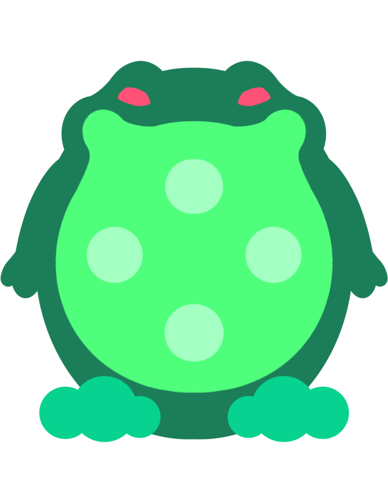

# Bigger

 

  

 

"Bigger" is a thrilling game where you control a frog born from a forbidden experiment that grows bigger by rampaging through the buildings. As a result, your frog will become even more unstoppable. With limited time to wreak havoc as other frogs race you to break the finite buildings Earth has to offer, your goal is to become the biggest froggo there ever was and dominate the world.

---

## Development
- Clone the project using `git clone https://github.com/Taiga74164/Bigger`
- Open the project with Unity 2021.3.16f1 or newer
- Open LoadingScene scene located at Assets/Scenes/LoadingScene.unity
- Play!

## Libraries and Resources Used
- [PUN 2](https://assetstore.unity.com/packages/tools/network/pun-2-free-119922)
- [Protocol Buffers](https://github.com/protocolbuffers/protobuf)

## Credits
Created, designed, and developed by [Brian](https://github.com/bmtechart), [Jay](https://github.com/Aeonamuse), and [Joaquin](https://github.com/Taiga74164). This project is our final submission for the Game Programming 2 course Winter 2023 at Bow Valley College.
